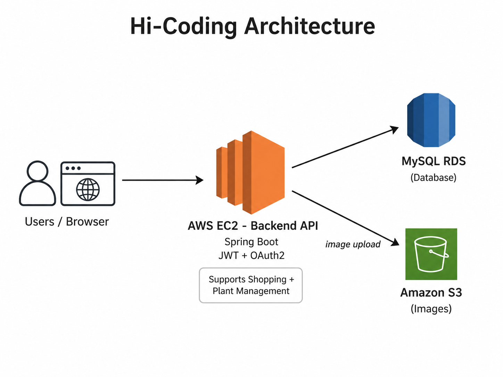

# Hi-Coding 배포 아카이브

Hi-Coding Backend는 AWS EC2, MySQL RDS, S3, Nginx, Docker, Jenkins를 이용해 배포 환경을 구성했습니다.

현재 운영 서버는 비용 관리 목적으로 종료된 상태이므로, 이 문서는 당시 배포 과정과 구성 방식을 기록한 아카이브입니다.

## 배포 구조



```text
Client / Browser
→ AWS EC2
→ Nginx
→ Spring Boot Backend
→ MySQL RDS

Spring Boot Backend
→ AWS S3
```

## 사용한 인프라

| 항목 | 내용 |
|---|---|
| Cloud | AWS |
| Application Server | EC2 Ubuntu |
| Database | MySQL RDS |
| File Storage | AWS S3 |
| Reverse Proxy | Nginx |
| HTTPS | Certbot / Let's Encrypt |
| CI/CD | Jenkins |
| Container | Docker |
| Registry | Docker Hub |

## AWS EC2 / RDS 구성

### RDS

MySQL RDS는 프리 티어 기준으로 생성했습니다.

- MySQL 선택
- Free tier 선택
- Storage auto scaling 설정 확인
- Public access 비활성화
- EC2와 같은 region / VPC 환경에 구성
- RDS Security Group에서 EC2 private IP의 MySQL 접근 허용

### EC2

EC2는 Ubuntu 기반 인스턴스로 구성했습니다.

- Ubuntu AMI
- Free tier instance type
- Key pair 기반 SSH 접속
- Storage 30GB 구성
- Security Group에서 필요한 포트만 허용

주요 포트:

| Port | 용도 |
|---:|---|
| 22 | SSH |
| 80 | HTTP |
| 443 | HTTPS |
| 8080 | Jenkins UI |
| 8081 | Spring Boot |
| 3000 | Frontend 개발/테스트 |

## SSH 접속 설정

pem key를 `~/.ssh`로 복사하고 권한을 제한했습니다.

```bash
cp {key-pair-path} ~/.ssh/
chmod 600 ~/.ssh/{key-pair-name}.pem
```

`~/.ssh/config`를 이용해 접속 명령을 단순화했습니다.

```text
Host springBoot
    HostName {EC2_public_IP}
    User ubuntu
    IdentityFile ~/.ssh/{key-pair-name}.pem
```

접속:

```bash
ssh springBoot
```

## EC2 서버 기본 설정

EC2에 Java, MySQL client, Nginx 등을 설치했습니다.

```bash
sudo apt update
sudo apt install openjdk-17-jdk
sudo apt install mysql-server
sudo apt install nginx
sudo systemctl enable nginx
```

Java 환경 변수:

```bash
export JAVA_HOME=/usr/lib/jvm/java-17-openjdk-amd64
export PATH=$JAVA_HOME/bin:$PATH
```

## Swap Memory 설정

프리 티어 인스턴스의 메모리 부족 문제를 완화하기 위해 swap memory를 설정했습니다.

```bash
sudo dd if=/dev/zero of=/root/swapfile bs=1k count=2000000 conv=excl
sudo chmod 600 /root/swapfile
sudo mkswap /root/swapfile
sudo swapon /root/swapfile
free -m
```

부팅 시 자동 활성화:

```bash
echo '/root/swapfile none swap sw 0 0' | sudo tee -a /etc/fstab
```

## 수동 배포 방식

CI/CD 자동화 전에는 Gradle `bootJar`로 JAR를 생성하고, FileZilla 등을 이용해 EC2로 파일을 전송했습니다.

JAR 실행:

```bash
nohup java -jar /home/ubuntu/{app-name}.jar > app.log 2>&1 &
```

프로세스 확인:

```bash
ps -ef | grep {app-name}.jar
```

프로세스 종료:

```bash
kill {process_id}
```

## Nginx Reverse Proxy

Spring Boot를 직접 외부에 노출하지 않고 Nginx가 요청을 받아 내부 Spring Boot port로 전달하도록 구성했습니다.

```nginx
upstream codingmall {
    server 127.0.0.1:8081;
}

server {
    server_name {domain};

    location / {
        proxy_pass http://codingmall;
        proxy_set_header Host $host;
        proxy_set_header X-Real-IP $remote_addr;
        proxy_set_header X-Forwarded-For $proxy_add_x_forwarded_for;
        proxy_set_header X-Forwarded-Proto $scheme;
    }

    listen 443 ssl;
    ssl_certificate /etc/letsencrypt/live/{domain}/fullchain.pem;
    ssl_certificate_key /etc/letsencrypt/live/{domain}/privkey.pem;
}
```

HTTP 요청은 HTTPS로 redirect했습니다.

```nginx
server {
    listen 80;
    server_name {domain};

    return 301 https://$host$request_uri;
}
```

## HTTPS 설정

Certbot을 이용해 Let's Encrypt 인증서를 발급했습니다.

```bash
sudo apt update
sudo apt install certbot python3-certbot-nginx
sudo certbot --nginx -d {domain}
```

자동 갱신:

```bash
sudo crontab -e
```

```text
0 0,12 * * * certbot renew --quiet
```

## UFW 방화벽

UFW를 이용해 필요한 포트를 허용했습니다.

```bash
sudo apt install ufw
sudo ufw enable
sudo ufw allow 22
sudo ufw allow 80
sudo ufw allow 443
```

Jenkins, Spring Boot, Frontend 테스트용 포트도 필요에 따라 허용했습니다.

## Fail2Ban

Nginx access log를 기반으로 반복적인 400/401/403/404/444/503 응답을 발생시키는 IP를 차단하도록 구성했습니다.

`/etc/fail2ban/jail.local`

```ini
[nginx]
enabled = true
port = http,https
filter = nginx
logpath = /var/log/nginx/access.log
backend = auto
maxretry = 10
findtime = 60
bantime = 3600
```

`/etc/fail2ban/filter.d/nginx.conf`

```ini
[Definition]
failregex = ^<HOST> .* "(GET|POST|PATCH|HEAD|PUT|DELETE) .*" (503|444|404|403|401|400) .*$
```

차단 확인:

```bash
sudo fail2ban-client status nginx
```

차단 해제:

```bash
sudo fail2ban-client set nginx unbanip {IP}
```

## 정리

Hi-Coding 배포 과정에서는 단순히 애플리케이션을 실행하는 것뿐 아니라, EC2/RDS/S3/Nginx/HTTPS/Jenkins/Docker를 연결해 하나의 운영 환경을 구성하는 경험을 했습니다.

이 과정에서 얻은 운영상의 한계와 개선 필요성을 바탕으로 Home-Socket에서는 Redis, Kafka, GitHub Actions, Oracle Cloud, PostgreSQL, health check, rollback, Fail2Ban 등을 추가로 구성했습니다.
