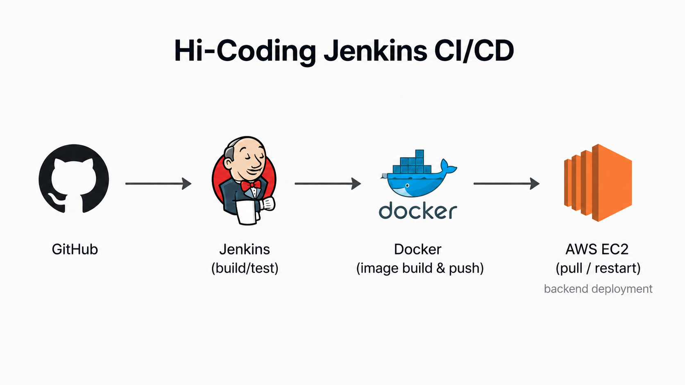

# Hi-Coding Jenkins CI/CD 정리

Hi-Coding Backend는 Jenkins를 Docker 컨테이너로 실행하고, GitHub Webhook을 통해 자동 빌드/배포 파이프라인을 구성했습니다.

## CI/CD 흐름



```text
GitHub push
→ Jenkins Webhook
→ Jenkins Pipeline
→ Gradle build
→ Docker image build
→ Docker Hub push
→ EC2 docker pull
→ 기존 컨테이너 stop/rm
→ 새 컨테이너 run
```

## Jenkins 실행 방식

Jenkins는 EC2 서버에서 Docker 컨테이너로 실행했습니다.

```bash
docker pull jenkins/jenkins:lts

docker run -d --name jenkins \
  -u root \
  -p 8080:8080 \
  -p 50000:50000 \
  -v /var/run/docker.sock:/var/run/docker.sock \
  -v jenkins_home:/var/jenkins_home \
  jenkins/jenkins:lts
```

`/var/run/docker.sock`을 mount하여 Jenkins 컨테이너 내부에서 host Docker daemon을 제어할 수 있도록 구성했습니다.

이 방식은 Docker Out of Docker 방식입니다.

## Docker Out of Docker

```text
Host Docker daemon
↑
Jenkins container
↑
Docker CLI
```

Jenkins 컨테이너 내부에서 Docker 명령을 실행하지만, 실제 Docker daemon은 host의 것을 사용합니다.

### 장점

- 설정이 Docker in Docker보다 단순함
- host Docker image cache를 공유하므로 build 속도가 빠름
- Jenkins 컨테이너에서 바로 image build/push/run 가능

### 단점

- Jenkins 컨테이너가 host Docker daemon을 제어하므로 격리 수준이 낮음
- 보안상 주의가 필요함

## Jenkins 플러그인

초기 설정 후 다음 플러그인을 사용했습니다.

- Pipeline
- GitHub Integration
- Docker Pipeline
- SSH Pipeline Steps
- SSH Agent

## Credentials

Jenkins에는 다음 credential을 등록했습니다.

| Credential | 용도 |
|---|---|
| GitHub | repository 접근 |
| DockerHub | Docker image push |
| SSH | EC2 배포 접속 |

SSH credential에는 EC2 접속용 private key를 등록했습니다.

## GitHub Webhook

GitHub repository에 Webhook을 추가했습니다.

```text
Payload URL: http://{jenkins-server-url}:8080/github-webhook/
Content type: application/json
```

Jenkins project에서는 다음 옵션을 사용했습니다.

```text
GitHub project
GitHub hook trigger for GITScm polling
```

## Pipeline Script

다음은 당시 구성한 Jenkins pipeline의 핵심 구조입니다.

```groovy
pipeline {
    agent any

    environment {
        IMAGE_NAME = "{dockerhub-repository/image-name}"
        REGISTRY_CREDENTIAL = "dockerhub"
        SSH_CREDENTIAL = "ssh"
        GITHUB_CREDENTIAL = "github"
        REPO_URL = "https://github.com/{owner}/{repo}.git"
        BRANCH = "develop"
        CONTAINER_NAME = "{container-name}"
        SPRINGBOOT_SERVER = "ubuntu@{domain-or-ec2-ip}"
    }

    stages {
        stage("Clone Repository") {
            steps {
                git branch: "${BRANCH}",
                    credentialsId: "${GITHUB_CREDENTIAL}",
                    url: "${REPO_URL}"
            }
        }

        stage("Build with Gradle") {
            steps {
                sh '''
                    chmod +x ./gradlew
                    ./gradlew clean build
                '''
            }
        }

        stage("Build Docker Image") {
            steps {
                sh "docker build -t ${IMAGE_NAME} ."
            }
        }

        stage("Push to Docker Hub") {
            steps {
                script {
                    docker.withRegistry("", REGISTRY_CREDENTIAL) {
                        sh "docker push ${IMAGE_NAME}"
                    }
                }
            }
        }

        stage("Deploy to EC2") {
            steps {
                sh '''
                    docker pull ${IMAGE_NAME}
                    docker stop ${CONTAINER_NAME} || true
                    docker rm ${CONTAINER_NAME} || true
                    docker run -d \
                      --name ${CONTAINER_NAME} \
                      -p 8081:8081 \
                      -v /home/ubuntu/.env:/app/.env \
                      ${IMAGE_NAME}
                '''
            }
        }
    }
}
```

## 배포 방식의 특징

Hi-Coding은 Docker image registry 기반 배포에 가깝게 구성했습니다.

| 항목 | 내용 |
|---|---|
| 배포 단위 | Docker image |
| 이미지 저장소 | Docker Hub |
| 이미지 빌드 위치 | Jenkins |
| 운영 서버 동작 | pull, stop, rm, run |
| 환경 변수 | EC2의 `.env`를 container에 volume mount |

## Home-Socket 방식과의 차이

| 항목 | Hi-Coding | Home-Socket |
|---|---|---|
| CI/CD 도구 | Jenkins | GitHub Actions |
| 배포 단위 | Docker image | JAR |
| 이미지 빌드 위치 | Jenkins | 운영 서버 |
| 이미지 전달 | Docker Hub push/pull | SCP로 JAR upload |
| 컨테이너 실행 | `docker run` 직접 실행 | `docker compose up` |
| Rollback | 별도 구현 필요 | JAR backup 기반 rollback |
| 여러 서비스 관리 | 개별 Docker 명령 중심 | Docker Compose service 중심 |

## 정리

Hi-Coding의 Jenkins CI/CD 구성은 Docker image를 중심으로 배포를 자동화한 경험입니다. 이후 Home-Socket에서는 GitHub Actions와 Docker Compose를 이용해 app container만 재생성하고, health check와 rollback을 추가해 배포 안정성을 개선했습니다.
